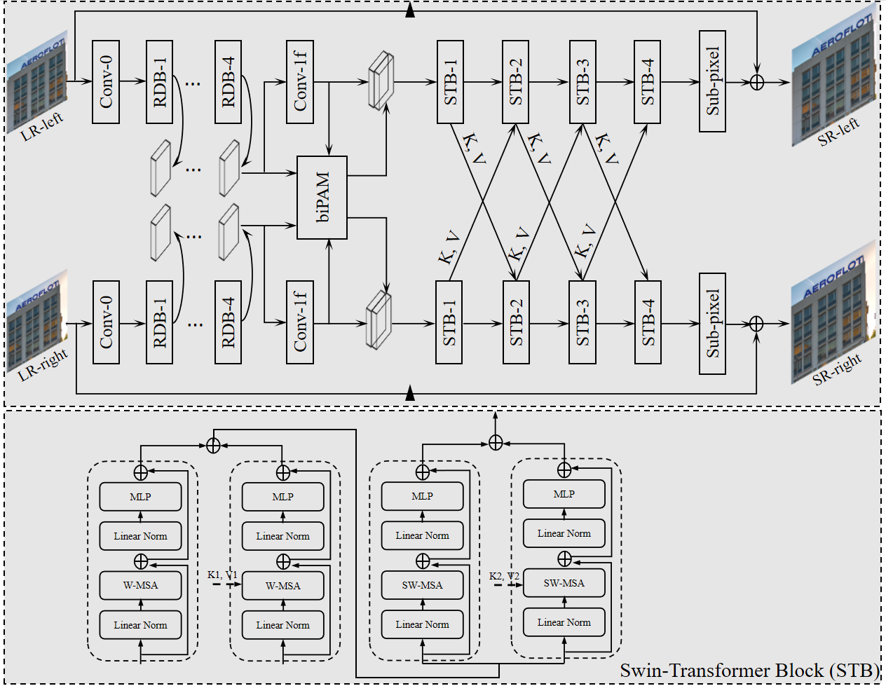

# Swin-iPASSR
### This is the source code of the 7th place solution for stereo image super resolution task in 2022 CVPR NTIRE challenge.

## Network Architecture:

    <h4 align="center">An overview of our Swin-iPASSR network.</h4>

## Download the Results:
**We share the quantitative and qualitative results achieved by our Swin-iPASSR on all the test sets for 4xSR. Results are available at [Google Drive](https://drive.google.com/file/d/1TsGV6KirbTi0T6yd2gqDrEi08n5hPPon/view)(including test images and models).**
 

## Codes and Models:
### Requirements
**PyTorch1.9.0，torchvision0.10.0. The code is tested with python=3.6, cuda=10.2.**
**Matlab for prepare training data**

### Train
* **Run `./data/train/GenerateTrainingPatches.m` to generate training patches.**
* **Run `train_1` and `_2.py` to perform training. Checkpoint will be saved to ./log/**

### Test
* **Download the test sets and unzip them to ./data**
* **Run `test_1` and `_2`.py to perform inference and calculate PSNR and SSIM scores.**

### Module Mean
* **Run `mean_weights.py`**

### **Model Ensemble**
* **Run `ensemble_calculate.py`**
